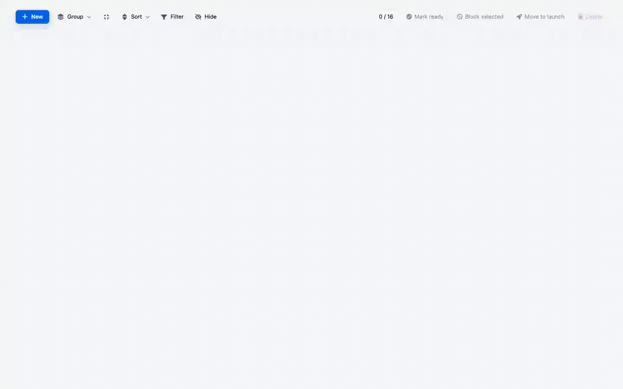

# Pro Project Table

A self-contained RevoGrid Pro project tracker implemented in Vanilla TypeScript, React, Vue, and Angular.

## Demo preview

[](./assets/pro-project-table-walkthrough.mp4)

_Click the animated preview to open the full-quality MP4._

## What it features

- Project grouping by section, status, priority, risk, department, or owner, with expandable groups and group-level metrics
- Selection-aware bulk actions plus row and column context menus
- Selection, text, date, number, and slider filters with custom filter-header rendering
- Dropdown, multi-select, date, currency, integer, progress, timeline, avatar, and rating cells
- Drag-and-drop row ordering, sorting, pinning, hiding, and responsive last-column stretching
- Additive multi-column sorting from Shift-clicked headers or Sort-menu choices, with visible sort-priority badges
- A column-add popup for adding and removing project-specific dynamic columns
- Inline project progress, budget summaries, editable fields, and light/dark theme controls

## Example-owned setup

All four framework variants use the same explicit plugin list and create their
column types from source in this example, so the runtime composition is ready
to copy into a host application.

| Package feature | How this demo uses it and why it helps |
| --- | --- |
| `createProjectColumnTypes` | Creates the `dropdown`, `select`, `date`, `currency`, and `integer` column types used by the static and dynamic project columns. |
| `projectPlugins` | Lists the Pro plugins used by the project table directly, making the runtime composition visible in the example. |

## Pro plugins registered by the example

These plugins come from `@revolist/revogrid-pro` and are listed explicitly in
`projectPlugins`.

| Pro plugin | How this demo uses it and why it helps |
| --- | --- |
| `EventManagerPlugin` | Provides the shared event lifecycle used by the preset stack, helping editing, selection, filtering, and other plugins cooperate. |
| `RowOrderPlugin` | Enables project rows to be reordered from the Project name handle; the demo supplies a compact project-name drag preview. |
| `RowSelectPlugin` | Powers the pinned checkbox column and selected-row state, enabling bulk actions, selection-aware menus, and moving checked projects together. |
| `ContextMenuPlugin` | Runs the custom row actions (duplicate, change state, move, and delete) and column actions (sort, filter, hide, and pin) next to the affected data. |
| `ColumnStretchPlugin` | Stretches the last visible column into unused width so the table fills its container cleanly. |
| `DimensionAnimationPlugin` | Smooths dimension changes, making group expansion, visibility changes, and other layout updates easier to follow. |
| `AdvanceFilterPlugin` | Adds the selection, string, date, slider, and numeric filtering used across project fields. |
| `FilterHeaderPlugin` | Places filter controls in the headers and supports the demo's custom owner, department, status, and skills filter summaries. |
| `ColumnHidePlugin` | Applies toolbar and context-menu visibility choices while preserving the underlying column definitions. |
| `ColumnAddPopupPlugin` | Opens the typed column chooser from the pinned add-column header and lets users add or remove project fields without rebuilding the grid. |

### Plugins installed automatically inside Pro plugins

These nested companions are created and reused internally; they are not listed in either the demo's plugin array or the preset's project plugin list.

| Auto-installed plugin | Installed by | Benefit in this demo |
| --- | --- | --- |
| `RowMasterAccessibilityPlugin` | `MasterRowPlugin` | Isolates keyboard and focus behavior for nested master-detail content if the project table later enables detail rows. |
| `ColumnGroupRenderSyncPlugin` | `ColumnHidePlugin` | Keeps grouped-header source indexes aligned with visible indexes as columns are hidden or restored. |

### Other Pro APIs used

| Pro API | Benefit in this demo |
| --- | --- |
| `ColumnDropdown` via `createProjectColumnTypes` | Provides single- and multi-select editors with custom option rendering for owners, status, priority, risk, departments, and skills. |
| `avatarTemplate` | Renders compact, consistent owner avatars in cells, editors, and filter controls. |
| `circularProgressRenderer` | Adds an immediately readable completion ring beside every project name. |
| `editorSlider` | Turns progress values into an in-cell visual control instead of requiring raw number entry. |
| `editorTimeline` | Displays project date ranges and completion together as a compact timeline. |
| `ColumnAddPopupConfig` | Defines the project-specific column catalog and add/remove callbacks consumed by `ColumnAddPopupPlugin`. |

Currency and integer formatting is supplied by `@revolist/revogrid-column-numeral`. Project grouping itself comes from RevoGrid Core; the Pro plugins add the richer filtering, selection, menus, visibility, ordering, popup, and rendering workflows around it.

### Additional Svelte prototype

`src/project-table.svelte` is an extra source prototype and is not wired into this package's dev or build scripts. It reuses the example-owned column types and directly adds `AdvanceFilterPlugin`, `FilterHeaderPlugin`, `ColumnHidePlugin`, and `TooltipPlugin`.

It reuses `circularProgressRenderer`, `editorSlider`, and `editorTimeline` from the inventory above and adds these Pro helpers:

| Svelte-only Pro API | Benefit in the prototype |
| --- | --- |
| `avatarRenderer` | Renders compact owner identities without a custom avatar template. |
| `arrayRenderer` and `linkRenderer` | Compose multiple links into one readable, reusable cell renderer. |
| `extendTemplates` | Layers the task label, color rail, progress ring, and tooltip trigger without replacing one template with another. |
| `commonAggregators` and `getGroupingData` | Calculate and render budget totals for each Core grouping row. |
| `defineDropdown` | Builds the add-column visibility chooser attached to the custom header button. |
| `ignoreCellEvents` and `EXPAND_ICON` | Keep custom grouped subheaders from stealing cell interactions and provide a consistent expand/collapse affordance. |

## Run it

```bash
pnpm dev          # Vanilla TypeScript
pnpm dev:react
pnpm dev:vue
pnpm dev:angular
```

Build variants use the matching `build:ts`, `build:react`, `build:vue`, and `build:angular` scripts.

## Main files

- `src/project-table.ts` — Vanilla TypeScript
- `src/project-table.react.tsx` — React
- `src/project-table.vue` — Vue
- `src/project-table.angular.ts` — Angular
- `src/project-tracker/plugins.ts` — explicit plugin registration
- `src/project-tracker/column-types.ts` — example-owned date, select, dropdown, and number column types
- `src/project-tracker/columns.ts` — project columns, renderers, editors, and add-column configuration
- `src/project-tracker/filters.ts` — Pro filter configuration and custom header templates
- `src/project-tracker/context-menus.ts` — row and column menu actions
- `src/project-tracker/grouping.ts` — Core grouping and group summary rendering
